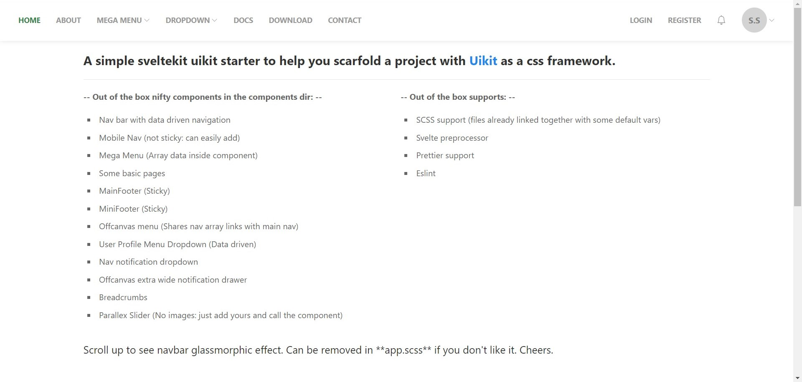
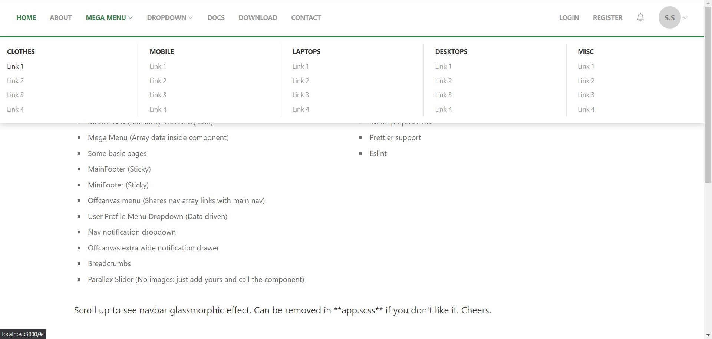
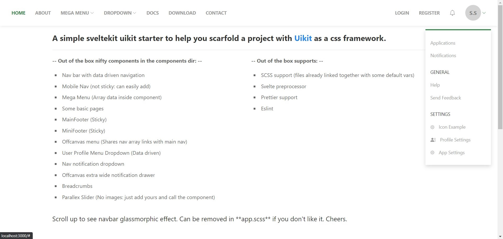
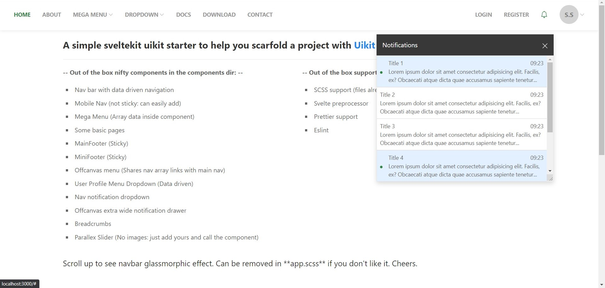

# Create Sveltekit + Uikit App

## A simple Sveltekit Uikit starter to help you scaffold a sveltekit project with Uikit as your beloved css framework.

## Out of the box supports:

- SCSS
- Svelte preprocessor
- Prettier
- Eslint

## Screenshots

### Homepage


### Mega Menu


### User Menu


### Notification Dropdown


## Prebuilt components

- Nav bar with data driven navigation
- Mobile Nav (not sticky: can easily add)
- Mega Menu (Array data inside component)
- Some basic pages (Home, Contact, Download, Login, Register)
- MainFooter (Sticky)
- MiniFooter (Sticky)
- Off canvas menu (Shares nav array links with main nav)
- User Profile Menu Dropdown (Data driven)
- Nav notification dropdown
- Off canvas extra wide notification drawer (Can be seen in mobile responsive mode)
- Breadcrumbs
- Parallex Slider (No images: add images and call the component)

Everything you need to build a Sveltekit + Uikit project, powered by [`create-svelte`](https://github.com/sveltejs/kit/tree/master/packages/create-svelte).

## Creating a project

Just run command below to clone the repository

```
git clone https://github.com/Sensei85/sveltikit-uikit-starter.git
```

## Developing

Once you've cloned the project and installed dependencies with `npm install` (or `pnpm install` or `yarn`), start a development server:

```bash
npm run dev

# or start the server and open the app in a new browser tab
npm run dev -- --open
```

## Building

To create a production version of your app:

```bash
npm run build
```

You can preview the production build with `npm run preview`.

> To deploy your app, you may need to install an [adapter](https://kit.svelte.dev/docs/adapters) for your target environment.
